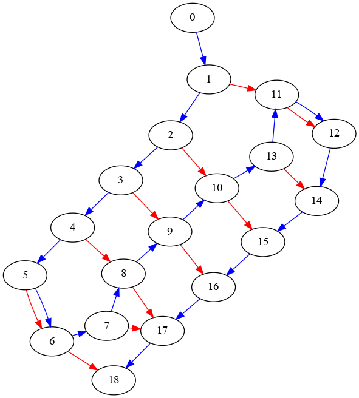

Not bothering with a real README yet. Here's my initial commit's message:

The fabric is represented with a Directed Knitting Graph. This is an
abstraction to represent various kinds of knit structures, where there
are both yarn edges (blue lines) defining the flow of continuous yarn,
and loop edges (red lines) defining where the yarn is looped over other
locations.

My understanding is that this idea came from Knitting with Directed
Graphs (Jared B. Counts, 2018) (see Figure 3-1). The figures and
further explanation of this idea in Wooly Graphs: A Mathematical
Framework for Knitting (Bell, Gray, Sieper, Kobourov, Schreiber,
Klein, and Hong, preprint 2024) has been helpful in helping me wrap my
brain around the concept. I was delighted to see that there's a group
working on graph models for knitting putting out papers this year.

[Counts' dissertation](https://dspace.mit.edu/handle/1721.1/119547)
was really inspiring to me-- especially the Hand Knitting chapter.

For now, the output of this program is a
[DOT](https://graphviz.org/doc/info/lang.html) representation of the
graph. I recommend using
[neato](https://graphviz.org/docs/layouts/neato/) as the layout engine
over the standard dot engine. Pipe the standard output from the program
into the `neato` command, with output options as you wish. Yarn edges
are blue, and loop edges are red. Node 0 is the yarn tail. Who weaves it
in right away? Not me!

Currently you can cast on, turn the fabric, and knit. The fabric struct
keeps track of what loops are currently on the needles. For a
right-handed knitter, the `in_needle` is your left hand, and the
`out_needle` your right. I
[knit mirrored](https://www.knitburo.com/knitting-left-handed/), so
consider this a compromise.

Trying to knit another stitch when your `in_needle` is empty will cause
the program to panic, but I want to fix that soon.

I couldn't figure out how to easily get the two kinds of edges
represented in an efficient Rust graph crate, so I'm going to keep
things small-scale for now and just store the edges as `Vec<(usize,
usize)>`. I figure I can develop the API and logic and can move to a
more efficient replacement when I need it. Petgraph is not currently a
dependency. I just forgot to remove it from the `.toml`.
